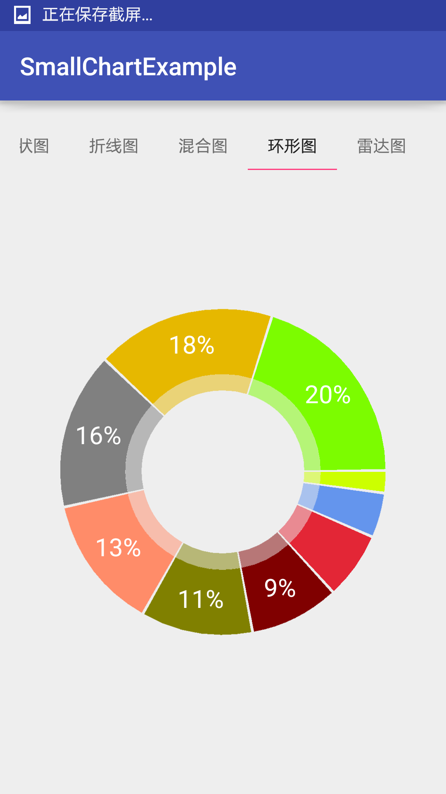

##  自定义View
>自定义View主要掌握以下四块内容：  
1.  绘制机制：掌握onMeasure,onLayout,onDraw及相关类的使用。  
2.  事件传递机制：掌握dispathTouchEvent(),onInterceptEvent(),onTouchEvent()三者的相关逻辑.  
3. 属性动画，因为属性动画核心是对数值的变化，使用属性动画对值View做动画操作。  
4. 相关手势类。

####一.View绘制机制
>掌握onMeasure,onLayout,onDraw及相关类的使用。

1. 绘制机制  
`view的绘制流程讲的最好的就是《Android开发艺术探究》这本书了，如果你还不是一名高工，想从事Android开发，这本书必备。不过还是给大家最近一篇，相信很多人已经看过了`  
[公共技术点之 View 绘制流程](http://a.codekk.com/detail/Android/lightSky/公共技术点之%20View%20绘制流程)
2. 相关类的使用，主要是指onDraw()方法里，Paint、Cavan、Matrix等类的使用。  

  ####[GcsSloop---自定义View系列](https://github.com/GcsSloop)     
    * [安卓自定义View基础 - 坐标系](https://github.com/GcsSloop/AndroidNote/blob/master/CustomView/Base/%5B01%5DCoordinateSystem.md)
    * [安卓自定义View基础 - 角度弧度](https://github.com/GcsSloop/AndroidNote/blob/master/CustomView/Base/%5B02%5DAngleAndRadian.md)
    * [安卓自定义View基础 - 颜色](https://github.com/GcsSloop/AndroidNote/blob/master/CustomView/Base/%5B03%5DColor.md)  
    * [安卓自定义View进阶 - 分类和流程](https://github.com/GcsSloop/AndroidNote/blob/master/CustomView/Advance/%5B01%5DCustomViewProcess.md)
    * [安卓自定义View进阶 - 绘制基本图形](https://github.com/GcsSloop/AndroidNote/blob/master/CustomView/Advance/%5B02%5DCanvas_BasicGraphics.md)
    * [安卓自定义View进阶 - 画布操作](https://github.com/GcsSloop/AndroidNote/blob/master/CustomView/Advance/%5B03%5DCanvas_Convert.md)
    * [安卓自定义View进阶 - 图片文字](https://github.com/GcsSloop/AndroidNote/blob/master/CustomView/Advance/%5B04%5DCanvas_PictureText.md)
    * [安卓自定义View进阶 - Path基本操作](https://github.com/GcsSloop/AndroidNote/blob/master/CustomView/Advance/%5B05%5DPath_Basic.md)
    * [安卓自定义View进阶 - 贝塞尔曲线](https://github.com/GcsSloop/AndroidNote/blob/master/CustomView/Advance/%5B06%5DPath_Bezier.md)
    * [安卓自定义View进阶 - Path完结篇(伪)](https://github.com/GcsSloop/AndroidNote/blob/master/CustomView/Advance/%5B07%5DPath_Over.md)
    * [安卓自定义View进阶 - Path玩出花样(PathMeasure)](https://github.com/GcsSloop/AndroidNote/blob/master/CustomView/Advance/%5B08%5DPath_Play.md)
    * [安卓自定义View进阶 - Matrix原理](https://github.com/GcsSloop/AndroidNote/blob/master/CustomView/Advance/%5B09%5DMatrix_Basic.md)
    * [安卓自定义View进阶 - Matrix详解](https://github.com/GcsSloop/AndroidNote/blob/master/CustomView/Advance/%5B10%5DMatrix_Method.md)
    * [安卓自定义View进阶 - Matrix Camera](https://github.com/GcsSloop/AndroidNote/blob/master/CustomView/Advance/%5B11%5DMatrix_3D_Camera.md)
    * [安卓自定义View进阶 - 事件分发机制原理](https://github.com/GcsSloop/AndroidNote/blob/master/CustomView/Advance/%5B12%5DDispatch-TouchEvent-Theory.md)

 #### [爱哥的---自定义View其实很简单](http://blog.csdn.net/column/details/androidcustomview.html)
 
 * [自定义控件其实很简单1/12](http://blog.csdn.net/column/details/androidcustomview.html)
 *   [自定义控件其实很简单1/6](http://blog.csdn.net/column/details/androidcustomview.html)
 *  [自定义控件其实很简单1/4](http://blog.csdn.net/column/details/androidcustomview.html)
 *  [自定义控件其实很简单1/3](http://blog.csdn.net/column/details/androidcustomview.html)
 *  [自定义控件其实很简单5/12](http://blog.csdn.net/column/details/androidcustomview.html)
 *  [自定义控件其实很简单1/2](http://blog.csdn.net/column/details/androidcustomview.html)
 *  [自定义控件其实很简单7/12](http://blog.csdn.net/column/details/androidcustomview.html)
 *  [自定义控件其实很简单2/3](http://blog.csdn.net/column/details/androidcustomview.html)
 *  [自定义控件其实很简单3/4](http://blog.csdn.net/column/details/androidcustomview.html)

 ####二.事件传递机制
 >掌握dispathTouchEvent(),onInterceptEvent(),onTouchEvent()三者的相关逻辑.  
 
 `讲的最好的，最易懂的就是《Android群英传》，这里也为大家推荐一篇博客，还是出自codeKK`
 
 [公共技术点之 View 事件传递](http://a.codekk.com/detail/Android/Trinea/公共技术点之%20View%20事件传递)
 ####三.属性动画
 [公共技术点之 Android 动画基础](http://a.codekk.com/detail/Android/lightSky/公共技术点之%20Android%20动画基础)
 
 ##值的学习的五个自定义View开源项目
 
 1. [NumberProgressBar](https://github.com/daimajia/NumberProgressBar)(代码家)   
 这个项目可以熟练掌握如何控制view在界面中的位子

 
 2. [SmallChart](https://github.com/Idtk/SmallChart)   
 项目包括折线图、曲线图(可填充)、柱状图、扇形图、雷达图的绘制，让你对熟练使用draw()相关类。 
   
 3. [CircleImageView](https://github.com/hdodenhof/CircleImageView)   
  一个圆形的ImageView  
   
 4.  [PhotoView](https://github.com/chrisbanes/PhotoView)  
 对ImageView支持各种手势操作，缩放、移动、旋转...熟练掌握手势操作。
 
 5. [AndroidSwipeLayout](https://github.com/daimajia/AndroidSwipeLayout)  
 综合  
 
